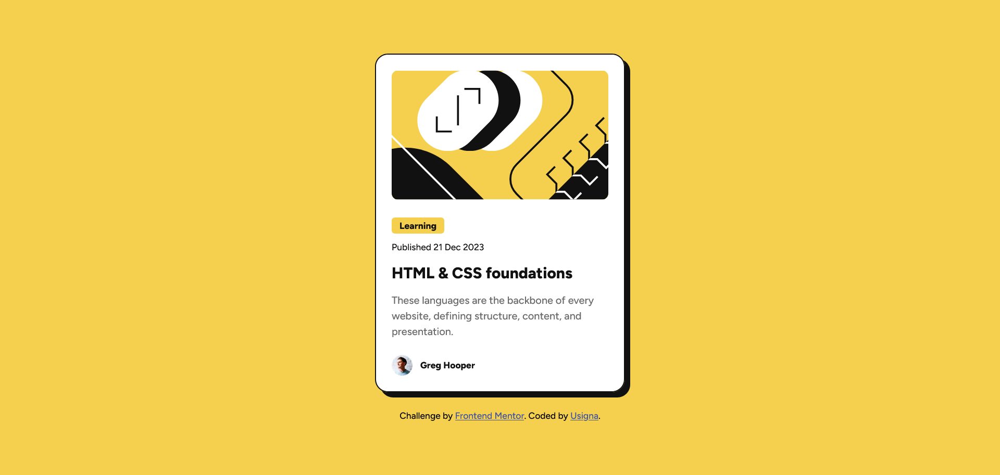

# Frontend Mentor - Blog preview card solution

This is a solution to the [Blog preview card challenge on Frontend Mentor](https://www.frontendmentor.io/challenges/blog-preview-card-ckPaj01IcS). Frontend Mentor challenges help you improve your coding skills by building realistic projects. 

## Table of contents

- [Overview](#overview)
  - [Screenshot](#screenshot)
  - [Links](#links)
- [My process](#my-process)
  - [Built with](#built-with)
- [Author](#author)

## Overview

### Screenshot

### Links

- Solution URL: [https://github.com/usignak/blog-preview-card](https://github.com/usignak/blog-preview-card)
- Live Site URL: [https://usignak.github.io/blog-preview-card](https://usignak.github.io/blog-preview-card)

## My process

### Built with

- HTML5
- CSS
- Flexbox

## Author

- Frontend Mentor - [@usignak](https://www.frontendmentor.io/profile/usignak)

